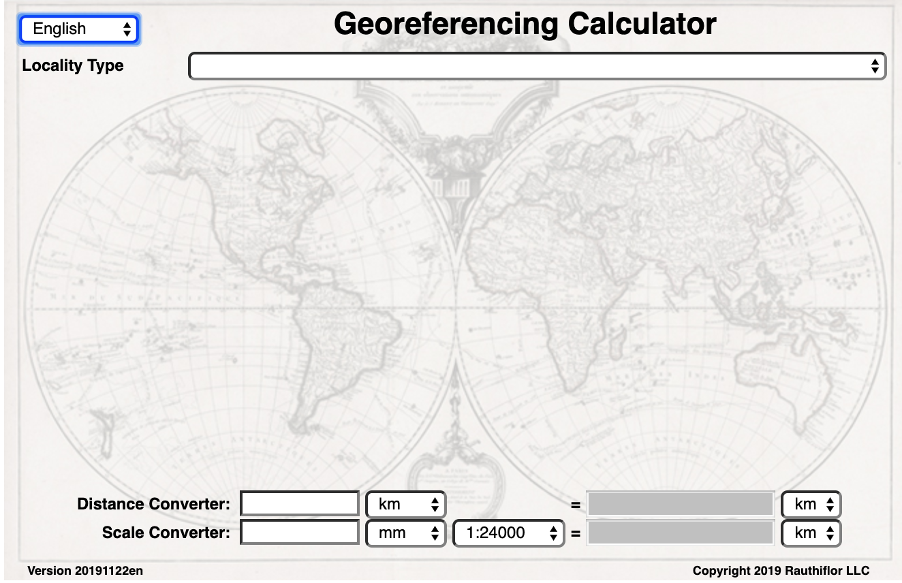

[[running]]
== Running the Calculator

The http://georeferencing.org/georefcalculator/gc.html[Georeferencing Calculator^] uses JavaScript and runs in a browser. The latest version can be initiated http://georeferencing.org/georefcalculator/gc.html[here^], or it can be downloaded in a .zip or .tar.gz archive from the https://github.com/VertNet/georefcalculator/releases[releases page of the Calculator GitHub repository^], unzipped to a convenient location and run in a browser by opening the file gc.html. Problems encountered with the Calculator should be entered as issues in the https://github.com/VertNet/georefcalculator/issues[GitHub repository issue tracker^] and should include the version identifier, which can be found in the lower right-hand corner of the Calculator (see xref:img-screen-image[xrefstyle="short"]). When the Calculator is opened it should appear as shown in xref:img-screen-image[xrefstyle="short"].

[#img-screen-image]
.Screen image of the Georeferencing Calculator when it first opens, showing the language selection drop-down, the _Locality Type_ drop-down box to initiate a georeference calculation, the _Distance Converter_, and the _Scale Converter_.

