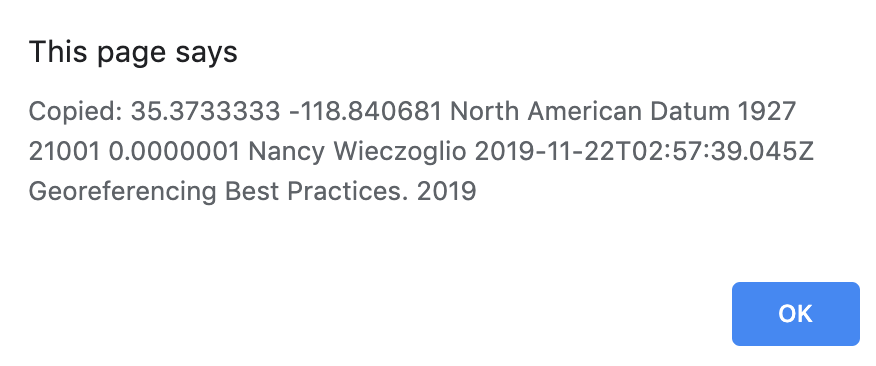
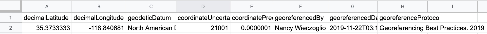

=== Step 1: Choose a Language

Click on the drop-down in the upper left-hand corner of the http://georeferencing.org/georefcalculator/gc.html[Calculator^] to choose the language for the interface. When the list is expanded, the application should appear as in xref:img-choose-language[xrefstyle="short"].

NOTE: The number format always uses the full stop '.' as the decimal indicator (e.g. 2.5 for the number halfway between 2 and 3), regardless of the selected language.

[#img-choose-language]
.Step 1: Choose a language. The Calculator with the five language options showing after opening the Language drop-down list.
image::img/web/choose-language.png[width=624,align="center"]

=== Step 2: Choose a Locality Type

Click on the _Locality Type_ drop-down to expand the list. When the list is expanded, the application should appear as in xref:img-choose-locality-type[xrefstyle="short"].

[#img-choose-locality-type]
.Step 2: Choose a locality type. The Calculator with the six basic locality types showing after opening the Locality Type drop-down list.
image::img/web/choose-locality-type.png[width=624,align="center"]

Select the _Locality Type_ that best matches the characteristics of the <<locality>> to be georeferenced. Each _Locality Type_ in the drop-down list shows an example to try to help match the locality to a <<locality-type,locality type>> using the pattern shown. Locality types with more examples are described in the {gqg}[Georeferencing Quick Reference Guide (Zermoglio et al. 2020)^].

=== Step 3: Enter Parameters

After selecting the _Locality Type_, a variety of text boxes, drop-down boxes, and buttons will appear on the Calculator (xref:img-enter-parameters[xrefstyle="short"]). These text and drop-down boxes need to be filled and/or values selected to make the calculation of the selected _Locality Type_. If no parameters are entered, then the default values will be used automatically.

[#img-enter-parameters]
.Step 3: Enter parameters. The Calculator after selecting the "Distance at a heading" Locality Type, with all of the relevant text and drop-down boxes needed to be filled in or selected correctly in order to do a georeference calculation.
image::img/web/enter-parameters.png[width=624,align="center"]

=== Step 4: Calculate

The _Calculate_ button appears after a _Locality Type_ is selected. After all the parameters are correctly chosen or entered, click the _Calculate_ button. The calculated results will fill the text boxes with grey backgrounds in the middle of the Calculator, below the buttons and above the converters.

.Calculation Example
====
Suppose the <<locality>> to be <<georeference,georeferenced>> is "10 mi E (by air) Bakersfield", as shown in the example in selection box for the "_Distance at a heading_" _Locality Type_ (for details about this type of locality see {gqg}#offset-distance-at-a-heading[Offset – Distance at a Heading^] in {gqg}[Georeferencing Quick Reference Guide (Zermoglio et al. 2020)^]. Next, suppose the <<coordinates>> for Bakersfield (35° 22′ 24″ N, 119° 1′ 4″ W) were obtained by determining the center of town to the nearest second using a USGS Gosford 1:24,000 Quad map.

To begin, select "_USGS map: 1:24,000_" from the _Coordinate Source_ drop-down. Next, select "_degrees minutes seconds_" from the _Coordinate Format_ drop-down. Next, enter the coordinates for Bakersfield in the _Input Latitude_ and _Input Longitude_ boxes that appear after selecting the _Coordinate Format_. Make certain to select the correct hemisphere from the drop-downs to the right of each coordinate field.

NOTE: For this example, the *coordinate-format,Coordinate Format>> "_degrees minutes seconds_" was selected because the USGS map showed coordinates in degrees minutes seconds, thus the coordinates determined for the center of Bakersfield were described in the same way. In some cases, coordinates on a map, or other resource, may be represented in degrees decimal minutes (e.g. 35° 22′ N, 119° 0′ W or 35° 22.4′ N, 119° 1.066667′ W) or as decimal degrees (e.g. 35.3733333, −119.0177778). The Coordinate Format selected in the Calculator MUST reflect the coordinate format used on the map or other resource.

The Gosford Quad map uses the North American 1927 horizontal <<datum>>, so select "_North American Datum 1927_" from the _Datum_ drop-down list. In most cases the datum can be found printed on the map, although sometimes an <<ellipsoid>> is listed instead. The Calculator also includes ellipsoids in the _Datum_ drop-down list. If a resource, such as a map with a datum, is not listed in the Calculator, try to find the ellipsoid for that datum using online resources such as http://epsg.io[epsg.io^] and then select the appropriate ellipsoid in the _Datum_ drop-down list.

The coordinates in this example have been specified to the nearest second, so select "_nearest second_" from the _Coordinate Precision_ drop-down list. The direction given in the locality description is E (east), so select "_E_" in the _Direction_ drop-down list. The <<offset>> distance is 10 mi (miles), so type "_10_" into the _Offset Distance_ text box and select "_miles_" from the _Distance Units_ drop-down list.

Bakersfield is a large place, and we don't know if the original locality means 10 miles from the center of town, 10 miles from the city limits, or something else entirely. Given that it is 3 miles from the specified coordinates to the furthest edge of town (as measured on the USGS map), the _Radial of Feature_ should be 3 miles (see {gqg}#feature-with-av-obvious-spatial-extent[Feature – with an Obvious Spatial Extent^] in the {gqg}[Georeferencing Quick Reference Guide^]). Enter "_3_" into the _Radial of Feature_ text field, since the units of the <<radial>> must be in the same units as the *offset*.

NOTE: If this distance had been measured in kilometers the value should be converted to miles using the *Distance Converter* at the bottom of the Calculator. The converted number should then be entered into the appropriate field (see <<coordinate-distance-and-scale-converters>> to learn how to use the converters). All distance measurements MUST be in the same units as the locality description for the Calculator to return proper results.

The determination of the coordinates for Bakersfield is only as <<accuracy,accurate>> as the tools that are used; the map, the size of the units on the measurement tool, and the georeferencer's ability to place a marker relative to items on the map. Any error associated with the map itself is accounted for in the _Coordinate Source_ selection. Error associated with the georeferencer's ability to measure on the map is accounted for in the _Measurement Error_ field.

To complete the _Measurement Error_ field, the smallest distance that can be measured on the map reliably and repeatedly must be determined. Generally, features or locations can be distinguished on a map to within about one (1) millimeter, given a ruler with millimeter divisions. If a ruler with English units is used, it may be possible to distinguish to 1/16th of an inch. The quality of the measuring tool, eyesight, and technique may alter these suggested values.

Once the smallest distance that can be measured consistently and reliably has been determined, enter that value and its units into the _Scale Converter_ at the bottom of the Calculator, select the scale of the map used for the measurement, and then select the unit of measure into which the conversion should be made. For example, if a digital measuring tool was used to measure to the nearest 0.1 mm on a 1:24000 map and this needs to be converted to miles, enter "_0.1_" into the _Scale Converter,_ then select "_mm_" from the units drop-down list. Next, choose the "_1:24000_" scale option in the map scale drop-down list. Finally, select "_mi_" in the second drop-down list. The value of 0.1 mm at 1:24000 converted into miles will be displayed in blue ("_0.00149 mi_") within the grey text box on the right side of the _Scale Converter_. Type "_0.00149_" into the _Measurement Error_ field, or move it from the _Scale Converter_ using copy and paste keyboard combinations.

Next, make certain that "_mi_" is selected in the _Distance Units_ drop-down, since the locality is described in miles ("10 mi E…"). The offset component in this locality is 10 mi, which is <<precision,precise>> to the nearest 10 miles (see the discussion on this topic in the section {gbp}#uncertainty-related-to-offset-precision[Uncertainty Related to Offset Precision^] in {gbp}[Georeferencing Best Practices (Chapman & Wieczorek 2020)^]. Select "_10 mi_" in the distance _Precision_ drop-down.

Next, click the _Calculate_ button. The calculated coordinates (always presented in <<decimal-degrees>>) for the locality "10 mi E (by air) Bakersfield" and the _Uncertainty_ for the calculation (always in meters) will be given in the controls just above the _Distance Converter_ at the lower part of the Calculator, as shown in xref:img-calculate[xrefstyle="short"].
====

[#img-calculate]
.Step 4: Calculate. The Calculator after clicking on the Calculate button, with all of the relevant text and drop-down boxes filled in or selected for an example of locality type "Distance at a heading". Results appear written in blue in the grey text boxes in the middle section of the Calculator below the Calculate button.
image::img/web/calculate.png[width=624,align="center"]

=== Step 5: Enter Metadata

After the results of the calculation have been presented, add the name of the georeferencer in the _Georeferenced by_ text box. If there is more than one person, separate the names in the list by ' | '. Finally, select the appropriate <<georeference,georeferencing>> _Protocol_. We recommend the {gqg}[Georeferencing Quick Referencing Guide (Zermoglio et al. 2020)^] as the <<georeferencing-protocol>> to follow and select. Do not use this option if the protocol was altered in any way. Rather, make a citable document available and reference that. People will rely on strict application of the georeferencing protocol in order to be able to reproduce a georeference given the same input parameters. If an undocumented protocol is followed, select "_protocol not recorded_". The example *georeference* from xref:img-calculate[xrefstyle="short"], with the metadata filled in, is shown in xref:img-enter-metadata[xrefstyle="short"].

[#img-enter-metadata]
.Step 5: Enter Metadata. The Calculator after entering an example of georeference metadata for the georeferencer and the georeferencing Protocol used.
image::img/web/enter-metadata.png[width=624,align="center"]

=== Step 6: Copy Results

The results (in blue in the middle section of the Calculator after clicking on the _Calculate_ button), including the metadata, can be copied onto the system clipboard by clicking on the _Copy_ button, after which a dialog box will appear displaying the content that has been copied, as shown in xref:img-copy-results[xrefstyle="short"].

NOTE: This dialog box does not get translated based on the language chosen for the Calculator interface. To close the box, click the _OK_ button. Once copied, the content can be transferred and pasted to a spreadsheet, database or text file as a tab-delimited record of the data for the current calculation.

[#img-copy-results]
.Step 6: Copy Results. Pop-up dialog box after clicking on the Copy button, showing the tab-delimited results of the example georeference that have been copied to the system clipboard.

=== Step 7: Paste Results

The content on the system clipboard after clicking on the _Copy_ button is tab-delimited. It can be pasted into a series of columns of a spreadsheet directly (this works in Excel as well as Google Sheets). It can also be pasted into a tab-delimited text file. When pasting the results, be certain that the order of the fields in the destination document matches the order of the fields in the results. Using http://rs.tdwg.org/dwc/terms/[Darwin Core standard term names^] (see also [(Wieczorek et al. 2012)^]), the order of the result fields is: 

* term:dwc[decimalLatitude]
* term:dwc[decimalLongitude]
* term:dwc[geodeticDatum]
* term:dwc[coordinateUncertaintyInMeters]
* term:dwc[coordinatePrecision]
* term:dwc[georeferencedBy]
* term:dwc[georeferencedDate]
* term:dwc[georeferenceProtocol]

Note that only the values are copied and can be pasted, and not the corresponding headers. xref:img-paste-results[xrefstyle="short"] shows the results after being pasted into a cell in a Google Sheet.

[#img-paste-results]
.Step 7: Paste Results. Part of a Google Sheet into which the results have been pasted. The column names reflecting Darwin Core terms were already in row 1 when the results were pasted into the cell A2.

=== Step 8: Start a New Calculation

A new calculation can be started simply by entering new parameter values and selecting new drop-down list values pertinent to the next calculation. If the _Locality Type_ for the next calculation is different from the previous one, make a new selection on the _Locality Type_ drop-down list. New parameters will appear that are relevant to the new _Locality Type_ calculation. Previously entered and chosen values will remain in the text and drop-down boxes and thus carry over to the next calculation whenever possible. This can increase the efficiency of calculations if <<locality>> descriptions that include the same feature are <<georeference,georeferenced>> one after another.

NOTE: Always check that all parameter values and choices are correct before accepting the results of a calculation. xref:img-new-calculation[xrefstyle="short"] shows the Calculator after selecting the _Locality Type_: _Geographic feature only_ for a new georeference following the georeference calculation shown in xref:img-enter-metadata[xrefstyle="short"]. Without doing anything further, the Calculator would be ready to calculate the georeference for the locality "Bakersfield" based on the previous entries. Note that the _Date_ value will change automatically when the _Calculate_ button is clicked.

[#img-new-calculation]
.Step 8: Start a New Calculation. The Calculator after selecting a new Locality Type to start a new georeference calculation following the calculation from xref:img-enter-metadata[xrefstyle="short"]. Note that there are fewer parameters to enter for this Locality Type, and that the relevant parameter values that were in the previous calculation are preserved for this calculation.
image::img/web/new-calculation.png[width=624,align="center"]
