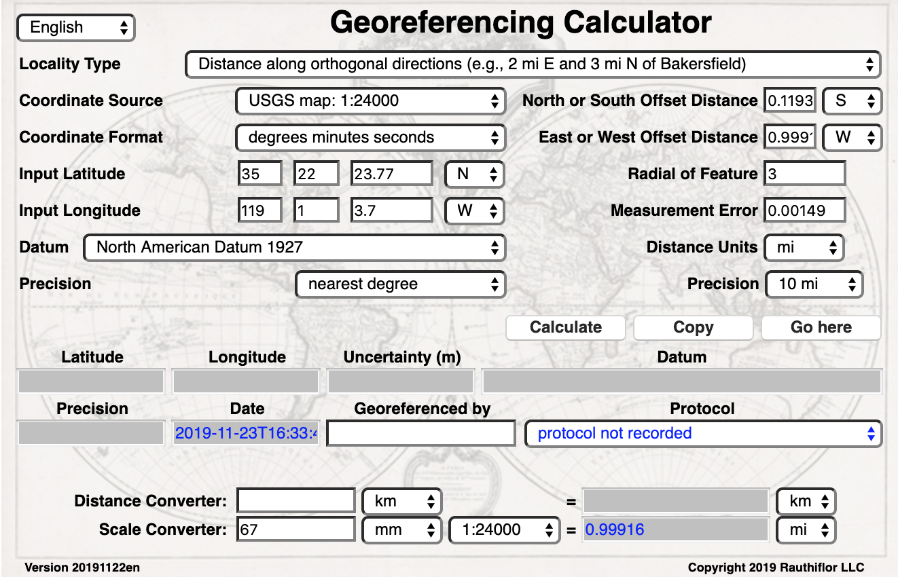

[[going-to]]
== "Going to" Calculated Coordinates

Now that the starting <<coordinates>> for the <<corrected-center>> of Bakersfield have been calculated after measuring <<offset,offsets>> on a map, use those coordinates to <<georeference>> subsequent <<locality>> descriptions that reference Bakersfield. Rather than copying and pasting (and possibly also converting) the coordinates into the xref:ui-input-latitude[role=ui-element] and xref:ui-input-longitude[role=ui-element] fields, click the xref:ui-go-here[role=ui-element] button to copy and convert the previous xref:ui-input-latitude[role=ui-element] and xref:ui-input-longitude[role=ui-element] from the results into the xref:ui-input-latitude[role=ui-element] and xref:ui-input-longitude[role=ui-element] fields in the xref:ui-coordinate-format[role=ui-element] currently in use (degrees minutes seconds in this example), as shown in xref:img-going-to[xrefstyle="short"].

[#img-going-to]
.Calculated coordinates pushed to input coordinates. The Calculator after clicking on the Copy button to move the coordinates in a previous result to the starting coordinates for a new calculation.

To complete a georeference using the new coordinates, follow the <<workflow,Basic Workflow>> starting with <<Step 2: Choose a Locality Type>>.
