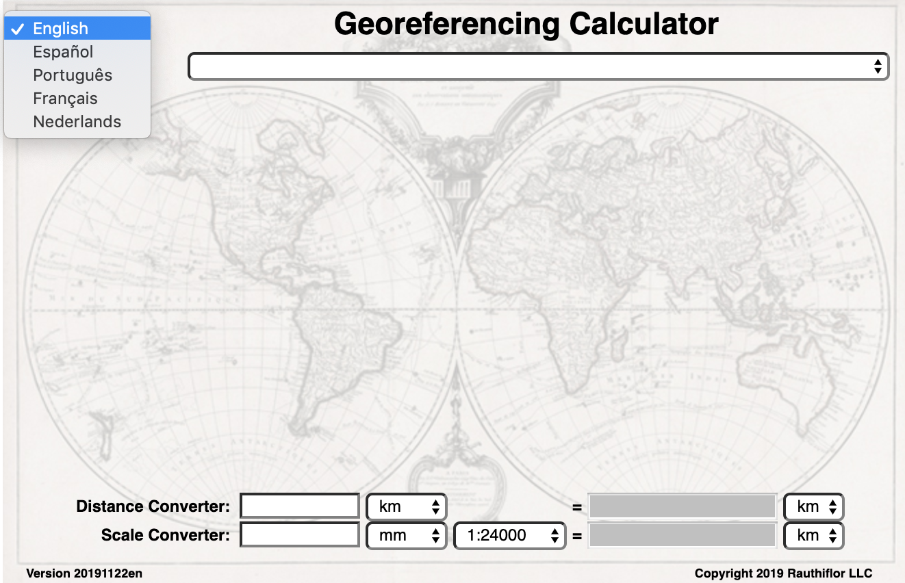
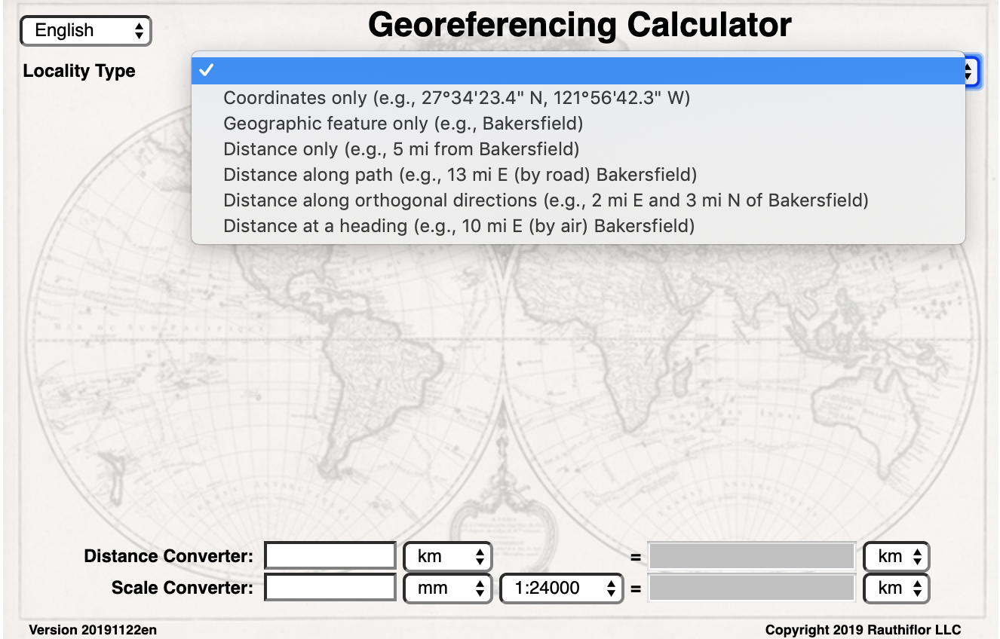
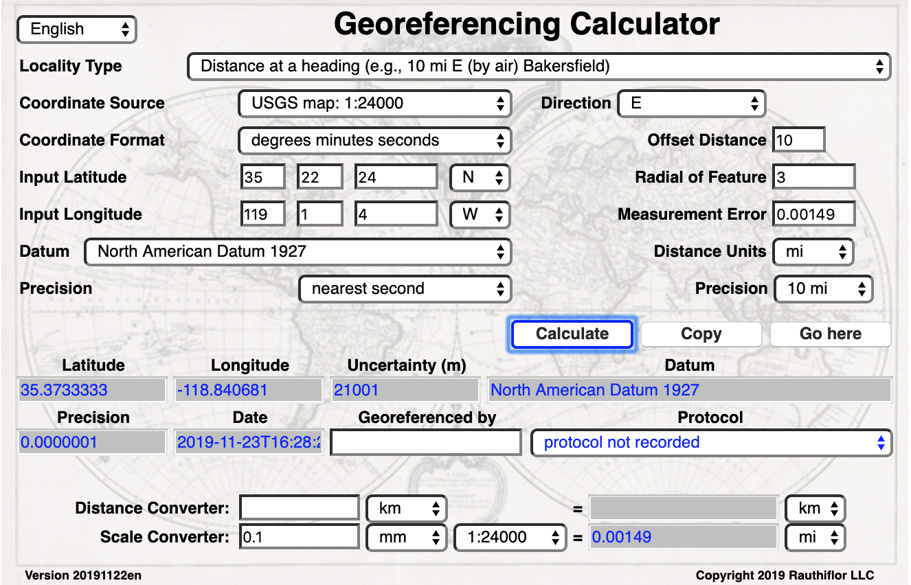
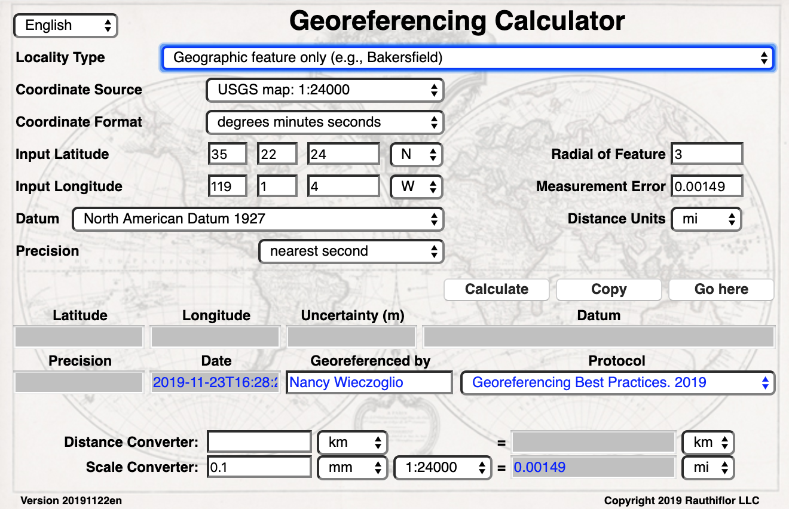
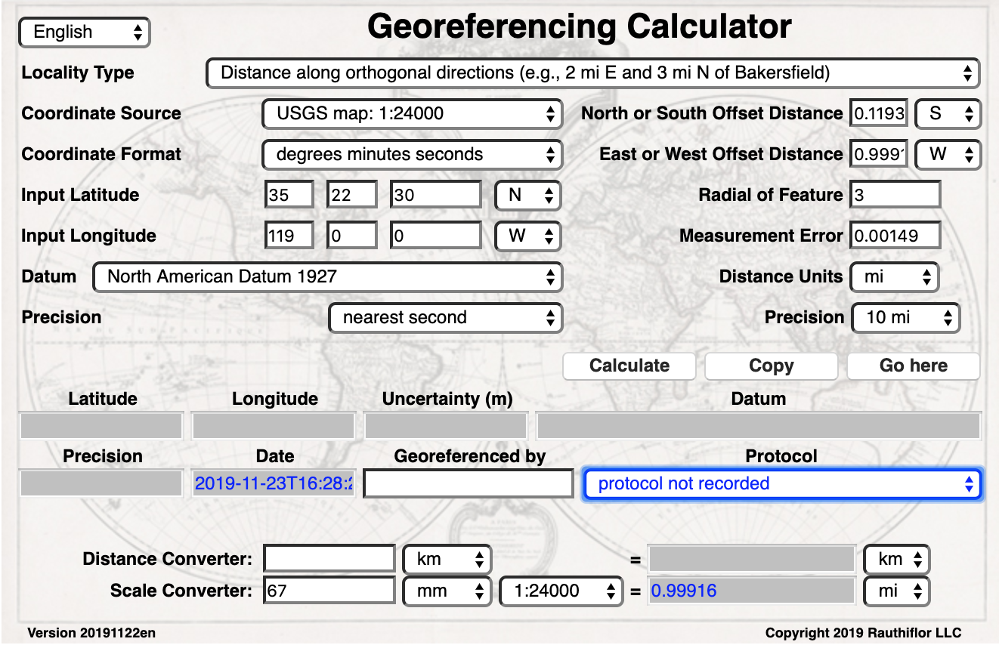
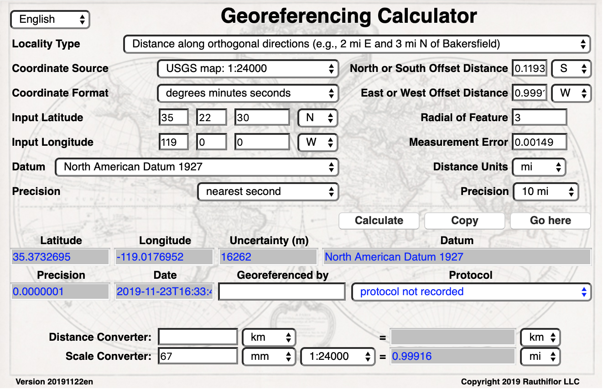
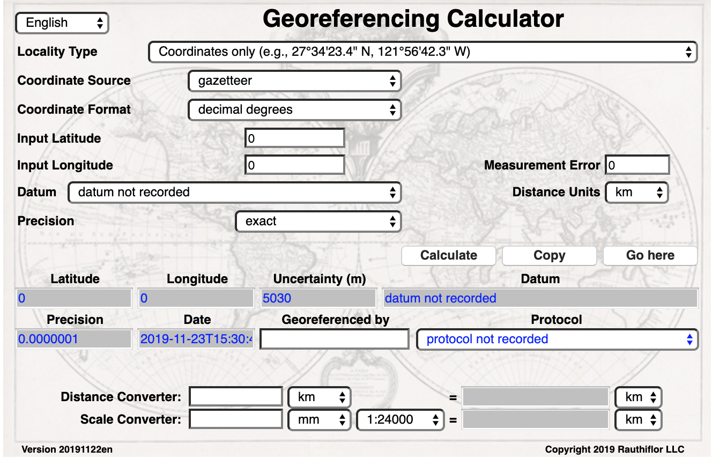

= Georeferencing Calculator Manual
:authorcount: 3
:author_1: David A. Bloom
:author_2: John R. Wieczorek
:author_3: Paula F. Zermoglio
:toc: left
:toclevels: 3
:numbered:
:revnumber: {git-metadata-sha-short}
:revdate: {git-metadata-date} {git-metadata-time} {git-metadata-timezone}
//:title-logo-image: img/western-honey-bee.jpg
:icons: font
:pagenums:
:license: https://creativecommons.org/licenses/by/4.0/
// Set <<these-links>> to use the name rather than "Section 1.2"
:xrefstyle: basic

ifdef::backend-pdf[]
:xrefstyle: full
:section-refsig: §
endif::backend-pdf[]

:idprefix:
:idseparator: -

// add cover image to img directory and update filename below
ifdef::backend-html5[]
//image::img/western-honey-bee.jpg[]
endif::backend-html5[]

:!sectnums:

== Colophon

[#citation]
=== Suggested citation
Bloom DA, https://orcid.org/0000-0003-1144-0290[Wieczorek JR], Zermoglio PF (2020) Georeferencing Calculator Manual. Copenhagen: GBIF Secretariat. https://doi.org/10.35035/TODOTODO

=== Licence
The document _Georeferencing Calculator Manual_ is licensed under https://creativecommons.org/licenses/by-sa/4.0[Creative Commons Attribution-ShareAlike 4.0 Unported License].

=== Persistent URI
https://doi.org/10.35035/TODOTODO

== Introduction

The *_Georeferencing Calculator_* (Wieczorek & Wieczorek 2019) described in this document is a tool created to aid in the *georeferencing* of descriptive *localities* such as those found in museum-based natural history collections. It was originally designed for the Mammal Networked Information System (MaNIS) and has been widely adopted in other large-scale collaborative *georeferencing* projects to supplement semi-automated *georeferencing* tools. The application makes calculations using the theory given in *_Georeferencing Best Practices_* (Chapman and Wieczorek 2020), derived from the earlier *_MaNIS/HerpNET/ORNIS Georeferencing Guidelines_* (Wieczorek 2001), and *_The point-radius method for georeferencing locality descriptions and calculating associated uncertainty_* (Wieczorek _et al._ 2004). Specific methods for calculating a wide variety of examples of the distinct *locality types* are given in *_Georeferencing Quick Reference Guide_* (Zermoglio _et al._ 2020).

// TODO Crosslink

Throughout this document there are terms in *bold*. These signify that there is a very specific meaning for the term as it is being used here, and these are defined in detail in the *_<<Glossary>>_* of *_Georeferencing Best Practices_*, some of which are included in the <<Glossary>> of this document as well, for convenience. Terms in italics and not bold (_e.g._, _Input Latitude_) are references to fields or their labels in the *_Calculator_*. Terms in italics and bold (_e.g._, *_georeferenceRemarks_*) are names of terms in the *<<Darwin Core>>**.

== Running the Calculator

The *_Georeferencing Calculator_* uses JavaScript andruns in a browser. The latest version can be initiated from http://georeferencing.org/georefcalculator/gc.html, or it can be downloaded in a .zip or .tar.gz archive from the https://github.com/VertNet/georefcalculator/releases[releases page on the *_Calculator_* GitHub repository], unzipped to a convenient location and run in a browser by opening the file gc.html. Problems encountered with the *_Calculator_* should be entered as issues in the https://github.com/VertNet/georefcalculator/issues[GitHub repository issue tracker] and should include the version identifier, which can be found in the lower right-hand corner of the *_Calculator_* (see Figure 1). When the *_Calculator_* is opened it should appear as shown in Figure 1.

[#img-screen-image]
.Figure 1. Screen image of the *_Georeferencing Calculator_* when it first opens, showing the language selection drop-down, the _Locality Type_ drop-down box to initiate a *georeference* calculation, the _Distance Converter_, and the _Scale Converter_.
image::img/screen-image.png[width=624,align="center"]

== Basic Workflow

The *_Calculator_* is designed to prompt the user only for what is needed to *georeference* based on the _Locality Type_ selected. The steps in the basic workflow are:

1. Choose the *_Calculator_* language.
2. Select the *Locality Type* that best matches the descriptive *locality* for the *georeference*. The interface will add all of the fields necessary to calculate the *georeference*.
// CROSSLINK TODO
3. Make selections and fill in all of the parameters shown. Refer to the <<Glossary>> and <<Georeferencing Concepts>> in the *_Georeferencing Quick Reference Guide_* to get a description of what each parameter means.
4. Click on the _Calculate_ button to calculate the results.
5. Enter the metadata for the person who is *georeferencing* and the *protocol* being used.
6. Click on the *_Copy_* button to put the results on the system clipboard.
7. Paste the results where the *georeference* will be stored.
8. Repeat for the next calculation. Note that the values for parameters chosen in one calculation will remain in the text and drop-down boxes and thus carry over to the next calculation whenever possible.

== Citation and Documentation

Any time the *_Georeferencing Calculator_* is used, the *georeferencer* should record its use.

If the *Darwin Core* standard is used to record *_Calculator_* output, the *_Calculator_* version and the date of use should be recorded in the field *_georeferenceSources_*. The following format should be used:

====
Wieczorek C, J Wieczorek. Georeferencing Calculator. Version: [yyyymmdd(language)]. Available: http://georeferencing.org/georefcalculator/gc.html. Accessed [yyyy-mm-dd].
====

.{blank}
[caption="For example"]
====
Wieczorek C, J Wieczorek. Georeferencing Calculator. Version: 20191217en. Available: http://georeferencing.org/georefcalculator/gc.html. Accessed 2020-01-28.
====

The version and language of the *_Calculator_* can be found in the lower left-hand corner of the calculator.

If the *Darwin Core* standard is not used to record calculator output, the *georeferencer* should record this citation in a suitable field in the database of choice and in any written documentation or notes for future georeferencing efforts.

== Detailed Workflow

=== Step 1: Choose a Language

Click on the drop-down in the upper left-hand corner of the *_Calculator_* to choose the language for the *_Calculator_* interface. Note that despite the language chosen, the number format always uses the full stop '.' as the decimal indicator (_e.g_., 2.5 for the number halfway between 2 and 3). When the list is expanded, the application should appear as in Figure 2.

[#img-choose-language]
.Figure 2. Step 1: Choose a language. The *_Calculator_* with the five language options showing after opening the _Language_ drop-down list.

=== Step 2: Choose a Locality Type

Click on the _Locality Type_ drop-down to expand the list. When the list is expanded, the application should appear as in Figure 3.

[#img-choose-locality-type]
.Figure 3. Step 2: Choose a locality type. The *_Calculator_* with the six basic *locality types* showing after opening the _Locality Type_ drop-down list.

Select the _Locality Type_ that best matches the characteristics of the *locality* to be georeferenced. Each _Locality Type_ in the drop-down list shows an example to try to help match the *locality* to a *locality type* using the pattern shown. *Locality types* with more examples are described in the *_Georeferencing Quick Reference Guide_*.

=== Step 3: Enter Parameters

After selecting the _Locality Type_, a variety of text boxes, drop-down boxes, and buttons will appear on the *_Calculator_* (Figure 4). These text and drop-down boxes need to be filled and/or values selected to make the calculation of the selected _Locality Type_. If no parameters are entered, then the default values will be used automatically.

[#img-enter-parameters]
.Figure 4. Step 3: Enter parameters. The *_Calculator_* after selecting the "_Distance at a heading_" _Locality Type_, with all of the relevant text and drop-down boxes needed to be filled in or selected correctly in order to do a *georeference* calculation.
image::img/enter-parameters.png[width=624,align="center"]

=== Step 4: Calculate

The _Calculate_ button appears after a _Locality Type_ is selected. After all the parameters are correctly chosen or entered, click the _Calculate_ button. The calculated results will fill the text boxes with grey backgrounds in the middle of the *_Calculator_*, below the buttons and above the converters.

.Calculation Example
====
Suppose the *locality* to be *georeferenced* is "10 mi E (by air) Bakersfield", as shown in the example in selection box for the "_Distance at a heading_" _Locality Type_ (for details about this type of locality see <<Offset – Distance at a Heading>> in *_Georeferencing Quick Reference Guide_*). Next, suppose the *coordinates* for Bakersfield (35° 22′ 24″ N, 119° 1′ 4″ W) were obtained by determining the center of town to the nearest second using a USGS Gosford 1:24,000 Quad map.

To begin, select "_USGS map: 1:24,000_" from the _Coordinate Source_ drop-down. Next, select "_degrees minutes seconds_" from the _Coordinate Format_ drop-down. Next, enter the *coordinates* for Bakersfield in the _Input Latitude_ and _Input Longitude_ boxes that appear after selecting the _Coordinate Format_. Make certain to select the correct hemisphere from the drop-downs to the right of each *coordinate* field.

NOTE: For this example, the *Coordinate Format* "_degrees minutes seconds_" was selected because the USGS map showed coordinates in degrees minutes seconds, thus the coordinates determined for the center of Bakersfield were described in the same way. In some cases, coordinates on a map, or other resource, may be represented in degrees decimal minutes (e.g., 35° 22′ N, 119° 0′ W or 35° 22.4′ N, 119° 1.066667′ W) or as decimal degrees (e.g., 35.3733333, −119.0177778). The *Coordinate Format* selected in the Calculator MUST reflect the coordinate format used on the map or other resource.

The Gosford Quad map uses the North American 1927 horizontal *datum*, so select "_North American Datum 1927_" from the _Datum_ drop-down list. In most cases the *datum* can be found printed on the map, although sometimes an *ellipsoid* is listed instead. The *_Calculator_* also includes *ellipsoids* in the _Datum_ drop-down list. If a resource, such as a map with a *datum,* is not listed in the *_Calculator_*, try to find the *ellipsoid* for that *datum* using online resources such as http://epsg.io[_epsg.io_] and then select the appropriate *ellipsoid* in the _Datum_ drop-down list.

The *coordinates* in this example have been specified to the nearest second, so select "_nearest second_" from the _Coordinate Precision_ drop-down list. The direction given in the *locality* description is E (east), so select "_E_" in the _Direction_ drop-down list. The *offset* distance is 10 mi (miles), so type "_10_" into the _Offset Distance_ text box and select "_miles_" from the _Distance Units_ drop-down list.

Bakersfield is a large place and we don't know if the original *locality* means 10 miles from the center of town, 10 miles from the city limits, or something else entirely. Given that it is 3 miles from the specified *coordinates* to the furthest edge of town (as measured on the USGS map), the _Radial of Feature_ should be 3 miles (see <<Feature – with an Obvious Spatial Extent>> in the *_Georeferencing Quick Reference Guide_*). Enter "_3_" into the _Radial of Feature_ text field, since the units of the *radial* must be in the same units as the *offset*.

NOTE: If this distance had been measured in kilometers the value should be converted to miles using the *Distance Converter* at the bottom of the Calculator. The converted number should then be entered into the appropriate field (see <<Coordinate, Distance and Scale Converters >> to learn how to use the converters). All distance measurements MUST be in the same units as the locality description for the Calculator to return proper results.

The determination of the *coordinates* for Bakersfield is only as *accurate* as the tools that are used; the map, the size of the units on the measurement tool, and the georeferencer's ability to place a marker relative to items on the map. Any *error* associated with the map itself is accounted for in the _Coordinate Source_ selection. *Error* associated with the georeferencer's ability to measure on the map is accounted for in the _Measurement Error_ field.

To complete the _Measurement Error_ field, the smallest distance that can be measured on the map reliably and repeatedly must be determined. Generally, features or locations can be distinguished on a map to within about one (1) millimeter, given a ruler with millimeter divisions. If a ruler with English units is used, it may be possible to distinguish to ¹⁄₁₆ of an inch. The quality of the measuring tool, eyesight, and technique may alter these suggested values.

Once the smallest distance that can be measured consistently and reliably has been determined, enter that value and its units into the _Scale Converter_ at the bottom of the *_Calculator_*, select the scale of the map used for the measurement, and then select the unit of measure into which the conversion should be made. For example, if a digital measuring tool was used to measure to the nearest 0.1 mm on a 1:24000 map and this needs to be converted to miles, enter "_0.1_" into the _Scale Converter,_ then select "_mm_" from the units drop-down list. Next, choose the "_1:24000_" scale option in the map scale drop-down list. Finally, select "_mi_" in the second drop-down list. The value of 0.1 mm at 1:24000 converted into miles will be displayed in blue ("_0.00149 mi_") within the grey text box on the right side of the _Scale Converter_. Type "_0.00149_" into the _Measurement Error_ field, or move it from the _Scale Converter_ using copy and paste keyboard combinations.

Next, make certain that "_mi_" is selected in the _Distance Units_ drop-down, since the *locality* is described in miles ("10 mi E…"). The *offset* component in this *locality* is 10 mi, which is *precise* to the nearest 10 miles (see the discussion on this topic in the section <<Uncertainty Related to Offset Precision>> in *_Georeferencing Best Practices_*). Select "_10 mi_" in the distance _Precision_ drop-down.

Next, click the _Calculate_button. The calculated *coordinates* (always presented in *decimal degrees*) for the *locality* "10 mi E (by air) Bakersfield" and the _Uncertainty_ for the calculation (always in meters) will be given in the controls just above the _Distance Converter_ at the lower part of the *_Calculator_*, as shown in
Figure 5.

[#img-calculate]
.Figure 5. Step 4: Calculate. The *_Calculator_* after clicking on the _Calculate_ button, with all of the relevant text and drop-down boxes filled in or selected for an example of *locality type* "_Distance at a heading_". Results appear written in blue in the grey text boxes in the middle section of the *_Calculator_* below the _Calculate_ button.

====

=== Step 5: Enter Metadata

After the results of the calculation have been presented, add the name of the georeferencer in the _Georeferenced by_ text box. If there is more than one person, separate the names in the list by ' | '. Finally, select the appropriate *georeferencing* _Protocol_. We recommend the *_Georeferencing Quick Referencing Guide_* as the *georeferencing protocol* to follow and select. Do not use this option if the protocol was altered in any way. Rather, make a citable document available and reference that. People will rely on strict application of the *georeferencing protocol* in order to be able to reproduce a *georeference* given the same input parameters. If an undocumented protocol is followed, select "_protocol not recorded_". The example *georeference* from Figure 5, with the metadata filled in, is shown in Figure 6.

[#img-enter-metadata]
.Figure 6. Step 5: Enter Metadata. The *_Calculator_* after entering an example of *georeference* metadata for the *georeferencer* and the *georeferencing* _Protocol_ used.
image::img/enter-metadata.png[width=624,align="center"]

=== Step 6: Copy Results

The results (in blue in the middle section of the _Calculator_ after clicking on the _Calculate_ button), including the metadata, can be copied onto the system clipboard by clicking on the _Copy_ button, after which a dialog box will appear displaying the content that has been copied, as shown in Figure 7.

NOTE: This dialog box does not get translated based on the language chosen for the Calculator interface. To close the box, click the *OK* button. Once copied, the content can be transferred and pasted to a spreadsheet, database or text file as a tab-delimited record of the data for the current calculation.

[#img-copy-results]
.Figure 7. Step 6: Copy Results. Pop-up dialog box after clicking on the _Copy_ button, showing the tab-delimited results of the example georeference that have been copied to the system clipboard.
image::img/copy-results.png[width=329,align="center"]

=== Step 7: Paste Results

The content on the system clipboard after clicking on the _Copy_ button is tab-delimited. It can be pasted into a series of columns of a spreadsheet directly (this works in Excel as well as Google Sheets™). It can also be pasted into a tab-delimited text file. When pasting the results, be certain that the order of the fields in the destination document matches the order of the fields in the results. Using http://rs.tdwg.org/dwc/terms/[*Darwin Core* standard] (Wieczorek _et al._ 2012; ) term names, the order of the result fields is: *_decimalLatitude_*, *_decimalLongitude_*, *_geodeticDatum_*, *_coordinateUncertaintyInMeters_*, *_coordinatePrecision_*, *_georeferencedBy_*, *_georeferencedDate_*, and *_georeferenceProtocol_*. Note that only the values are copied and can be pasted, and not the corresponding headers. Figure 8 shows the results after being pasted into a cell in a Google Shee™.

[#img-paste-results]
.Figure 8. Step 7: Paste Results. Part of a Google Sheethttps://docs.google.com/document/d/19zCg20WcRCqQeqJxU33np7IIFhuE4dPl_XKSNCggExM/edit#heading=h.c6adhmx0uk1[™] into which the results have been pasted. The column names reflecting *Darwin Core* terms were already in row 1 when the results were pasted into the cell A2.
image::img/paste-results.png[width=624,align="center"]

=== Step 8: Start a New Calculation

A new calculation can be started simply by entering new parameter values and selecting new drop-down list values pertinent to the next calculation. If the _Locality Type_ for the next calculation is different from the previous one, make a new selection on the _Locality Type_ drop-down list. New parameters will appear that are relevant to the new _Locality Type_ calculation. Previously entered and chosen values will remain in the text and drop-down boxes and thus carry over to the next calculation whenever possible. This can increase the efficiency of calculations if *locality* descriptions that include the same feature are *georeferenced* one after another.

NOTE: Always check that all parameter values and choices are correct before accepting the results of a calculation. Figure 9 shows the Calculator after selecting the *Locality Type* "*Geographic feature only*" for a new georeference following the georeference calculation shown in Figure 6. Without doing anything further, the Calculator would be ready to calculate the georeference for the locality "Bakersfield" based on the previous entries. Note that the *Date* value will change automatically when the *Calculate* button is clicked.

[#img-new-calculation]
.Figure 9. Step 8: Start a New Calculation. The *_Calculator_* after selecting a new _Locality Type_ to start a new *georeference* calculation following the calculation from Figure 6. Note that there are fewer parameters to enter for this _Locality Type_, and that the relevant parameter values that were in the previous calculation are preserved for this calculation.

== Calculating Coordinates from a Map

*Georeferences* for every *locality type* require *coordinates*. For all of the *locality types* except "_Coordinates only_" and "_Distance along path_", the *coordinates* of the *corrected center* of the reference *feature* are needed. In many cases these can be determined directly from a *gazetteer* or from an online tool such as Google Maps™. If the *coordinates* of a *feature* need to be determined from other reference points that have *coordinates* on a map (such as the corners), there is a nice little trick that can be done with the *_Georeferencing Calculator_* to determine the *coordinates* of the *feature* easily. For example, to *georeference* the *locality* "10 mi E (by air) Bakersfield", first determine the *coordinates* for "Bakersfield". Suppose the _Coordinate Source_ is the USGS Gosford 1:24,000 Quad map. Once the *corrected center* of Bakersfield has been determined on the map, find a convenient spot on the map having known *coordinates*, such as the corner nearest to the feature. In this case, the northeast corner of the map is closest and marked with the *coordinates* 35° 22′ 30″ N, 119° 00′ W.

To begin the calculation, select the _Locality Type_ "_Distance along orthogonal directions_" (because the measurement is due south and due west from the northeast corner of the map to the *corrected center* of Bakersfield). Next, select "_degrees minutes seconds_" as the _Coordinate Format_. Enter the *coordinates* of the known point (the northeast corner of the map, in this example) into the _Input Latitude_ and _Longitude_ fields (35° 22′ 30″ N, 119° 0′ 0′ W – don't neglect the hemisphere indicators). Select "_North American Datum 1927_" as the _Datum_ used by the map.

Now use a measuring tool (_e.g._, a ruler) to measure a) the distance between the northeast corner of the map and the line of *latitude* of the *corrected center* of Bakersfield where it meets the east edge of the map, and b) the distance between the northeast corner of the map and the line of *longitude* of the *corrected center* of Bakersfield where it meets the north edge of the map. These are the orthogonal distances to the S and W of the known point, the northeast corner of the map.

NOTE: Convert all measurements made on the maps (mm, cm, or inches) into the distance unit provided in the locality (miles, in this example). Use the *Scale Converter* at the bottom of the Calculator, to do this calculation (see <<Coordinate, Distance and Scale Converters>>).

The point we have determined to be the *corrected center* of Bakersfield is 8 mm south of the 35° N line of *latitude* and 67 mm west of the 119° W line of *longitude*. After the _Scale Converter_ has been used to convert millimeters to miles, cut and paste the values for miles into the _Offset Distance_ text boxes on the right side of the *_Calculator_*: 0.1193 should be pasted or typed into the _North or South Offset Distance_ field, and the cardinal direction drop-down should be set to "_S_" (south); 0.99916 should be pasted or typed into the _East or West Offset Distance_ field, and the cardinal direction drop-down should be set to "_W_" (west). The _Distance Units_ drop-down should display "_mi_" (miles), since that is the unit described in the *locality*. The *_Calculator_* now has all of the parameters necessary to complete the calculation and should appear as in Figure 10.

[#img-calculate-from-a-map]
.Figure 10. Calculating coordinates from a map: The *_Calculator_* after setting the parameters needed to calculate the *coordinates* of the *corrected center* of Bakersfield by using measured *offsets* south and west of the northeast corner of a 1:24000 map, converted to miles.

Next, click the _Calculate_ button. The calculated *coordinates* (always in *decimal degrees*) for the *corrected center* of Bakersfield are displayed in blue in the _Output Latitude_ and _Longitude_ fields in the results section of the *_Calculator_*, as shown in Figure 11.

NOTE: This calculation was only to determine a new set of coordinates based on offsets from a known set of coordinates. The parameters *Coordinate Precision*, *Radial of Feature*, *Measurement Error*, and *Distance Precision* were irrelevant to this calculation.

[#img-calculated-from-a-map]
.Figure 11. Calculated coordinates from a map. The *_Calculator_* after clicking on the _Calculate_ button to determine the *coordinates* of Bakersfield by using measured *offsets* south and west of the northeast corner of a 1:24000 map, converted to miles.

== "Going to" Calculated Coordinates

Now that the starting *coordinates* for the *corrected center* of Bakersfield have been calculated after measuring *offsets* on a map, use those *coordinates* to *georeference* subsequent *locality* descriptions that reference Bakersfield. Rather than copying and pasting (and possibly also converting) the *coordinates* into the _Input Latitude_ and _Longitude_ fields, click the _Go Here_ button to copy and convert the previous _Latitude_ and _Longitude_ from the results into the _Input Latitude_ and _Longitude_ fields in the _Coordinate Format_ currently in use (degrees minutes seconds in this example), as shown in Figure 12.

[#img-going-to]
.Figure 12. Calculated coordinates pushed to input coordinates. The *_Calculator_* after clicking on the _Copy_ button to move the *coordinates* in a previous result to the starting *coordinates* for a new calculation.
image::img/going-to.png[width=624,align="center"]

To complete a *georeference* using the new coordinates, follow the *Basic Workflow* starting with <<Step 2: Choose a Locality Type>>.

== Coordinate, Distance, and Scale Converters

The *_Calculator_* has three converters built in to eliminate the need for additional tools during the *georeferencing* process. Built into the parameters section of the *_Calculator_* is a converter to change the format of *coordinates* between three *geographic coordinate* options: *decimal degrees*, degrees decimal minutes, and degrees minutes seconds.

To convert between coordinate formats, simply select the desired format from the _Coordinate Format_ drop-down list. The text and drop-down boxes for the _Input Latitude_ and _Longitude_ will change and be populated with the values in the new format. For *coordinate systems* other than *geographic coordinates *(e.g., *UTM*), a *coordinate* transformation into *geographic coordinates* will have to be done to use the *_Georeferencing Calculator_*.

Below the _Calculate_ section of the *_Calculator_* is a _Distance Converter_. To convert a distance from one unit to another, put the value and units in the text and drop-down boxes in the _Distance Converter_, to the left of the "=". The value in the units of the drop-down box will appear in blue in the text box with the grey background on the right side of the "=". For example, to convert 10 miles into kilometers, enter "_10_" in the first field of the _Distance Converter_, select "_mi_" from the left-hand unit drop-down list, and select "_km_" from the right-hand unit drop-down list. The result, "_16.09344_", automatically appears in the right-hand text box. This value can be copied and placed into a distance field in the input area of the *_Calculator_* or elsewhere (see Figure 13).

[#img-distance-conversion]
.Figure 13. Distance Conversion. The _Distance Converter_ section of the *_Calculator_* showing a conversion of 10 miles into kilometers.
image::img/distance-conversion.png[width=624,align="center"]

Below the _Distance Converter_ is a _Scale Converter_ designed to convert a measurement on a map of a given scale to a real-world distance in another unit. To convert a distance measured on a map with a known scale into a distance on the ground, put the distance value, distance units, and map scale in the text and drop-down boxes in the _Scale Converter_, to the left of the "=". The value in the units of the drop-down box to the right of the "=" will appear in blue in the text box with the grey background on the right side of the "=". For example, to convert a map measurement of 8 centimeters on a 1:50000 map into miles on the ground, enter "_8_" in the first field of the _Scale Converter_, select "_cm_" from the left-hand unit drop-down list, select "_1:50000_" in the second drop-down list, containing scales, and select "_mi_" from the right-hand unit drop-down list. The result, "_2.48548_", automatically appears in the right-hand text box. This value can be copied and placed into a distance field in the input area of the *_Calculator_* or elsewhere (see Figure 14).

[#img-scale-convertion]
.Figure 14. Map Measurement Distance Conversion. The _Scale Converter_ section of the *_Calculator_* showing a conversion of 8 centimeters on a map of 1:50000 scale to miles on the ground.

== Understanding uncertainty contributions

The *_Calculator_* is an excellent tool for investigating the contributions to *uncertainty* from distinct sources. For any given _Locality Type_, one can nullify all but one source of *uncertainty* to see what the contribution to overall *uncertainty* is from that source. For example, to see what the contribution to overall *uncertainty* is from an unknown *datum* at a given *location*, choose the "_Coordinate only_" _Locality Type_, set the _Input Latitude_ and _Longitude_ to the place that needs to be checked, set the _Coordinate Source_ to "_gazetteer_" or "_locality description_" (because neither of these choices contributes an *uncertainty* to the calculation), select "_datum not recorded_" from the _Datum_ drop-down list, select "_exact_" from the _Coordinate Precision_ drop-down list, set the _Measurement Error_ to "_0_". With these settings, the only source of *uncertainty* is the unknown *datum*. At the *coordinate* 0,0, the calculated *uncertainty* is 5030m, as shown in Figure 15. This large *uncertainty* reflects the maximum distance between the point 0,0 in any *geographic coordinate reference system* and the point 0,0 in the *coordinate reference system* *WGS84*. See <<Coordinate Reference System>> in *_Georeferencing Best Practices_* for further discussion on the subject.

[#img-isolating-uncertainty]
.Figure 15. Isolating *uncertainty* from an unknown *datum*. The *_Calculator_* showing parameter settings that reveal the *uncertainty* due to an unknown *datum* at the *coordinate* 0,0. The choices of all other parameters nullify all other contributions to overall *uncertainty*.

[glossary]
== Glossary

This glossary explains the user interface elements of the *_Calculator_* and how they relate to the underlying calculations.

[glossary]
[[Calculate]]Calculate:: Button used to calculate *coordinates* and *uncertainty* using the *point-radius method* (Wieczorek _et al._ 2004), based on the values of parameters pertinent to the selected _Locality Type_. Clicking on the *_Calculate_* button fills in the results section of the *_Calculator_* formatted as *Darwin Core* fields that need to be recorded for a *georeference* that follows the *_Georeferencing Best Practices_* (_i.e._, *_decimalLatitude_*, *_decimalLongitude_*, *_geodeticDatum_*, *_coordinateUncertaintyInMeters_*, *_coordinatePrecision_*, *_georeferencedBy_*, *_georeferencedDate_*, and *_georeferenceProtocol_*). The calculation combines the sources of *uncertainty* using an algorithm appropriate to the *locality type *(see <<Calculating Uncertainties>> in *_Georeferencing Best Practices_*). The calculations account for *uncertainties* due to *coordinate precision*, unknown *datum*, data source, *GPS* *error*, measurement *error*, *feature geographic radial*, distance *precision*, and *heading* *precision*.

[[Coordinate-Format]]Coordinate Format:: Defines the original *geographic coordinate format* (*decimal degrees*, degrees minutes seconds, degrees decimal minutes) of the *coordinate* source. Equivalent to the *Darwin Core* term *_verbatimCoordinateSystem_*. Selecting the original _Coordinate Format_ allows the *coordinates* to be entered in their native format and forces the *_Calculator_* to present appropriate options for _Coordinate Precision_. Note that changing the _Coordinate Format_ will reset the _Coordinate Precision_ value to "_nearest degree_". Be sure to correct this for the actual *coordinate precision*. Behind the scenes, the *_Calculator_* stores *coordinates* in *decimal degrees* to seven decimal places. This is to preserve the correct *coordinates* in all formats regardless of how many transformations are done.

[[Coordinate-Precision-input]]Coordinate Precision (input):: Labeled as _Precision_ in the first column of input parameters, this drop-down list is populated with levels of *precision* in keeping with the _Coordinate Format_ chosen for the verbatim original *coordinates*. This is similar to, but *NOT* the same as the *Darwin Core* term *_coordinatePrecision_*, which applies to the output *coordinates*. A value of "_exact_" is any level of *precision* higher than the otherwise highest *precision* given on the list. Example: For 35° 22′ 24″, the _Coordinate Precision_ would be "_nearest second_".

[[Coordinate-Precision-output]]Coordinate Precision (output):: Labeled as _Precision_ in the results, this text box is populated with *precision* of the output *coordinates*, and as such is equivalent to the *Darwin Core* term *_coordinatePrecision_*. The *precision* of the output in the *_Calculator_* is always "_0.0000001_", no matter how many digits appear to the right of the decimal indicator in the _Output Latitude_ and _Output Longitude_.

[[Coordinate-Source]]Coordinate Source:: The resources (map, *GPS*, *gazetteer*, *locality* description) from which the _Input Latitude_ and _Longitude_ were derived. Related to, but *NOT* the same as the *Darwin Core* term *_georeferenceSources_*, which requires the specific resources used rather than their characteristics. Note that the *uncertainties* from the two sources "_gazetteer_" and "_locality description_" can not be anticipated universally, and therefore do not contribute to the *uncertainty* in the calculations. If the *error* characteristics of the specific sources of this type are known, they can be added in the _Measurement Error_ before calculating. If the source "_GPS_" is selected, the label for _Measurement Error_ will change to _GPS Accuracy_, which is where *accuracy* distance of the *GPS* at the time the *coordinates* were taken should be entered. For details on _GPS Accuracy_ see <<Using a GPS>>* in *_Georeferencing Best Practices_*.

[[Datum]]Datum:: Defines the position of the origin and orientation of an *ellipsoid* upon which the *coordinates* are based for the given _Coordinate Source_. Equivalent to the *Darwin Core* term *_geodeticDatum_*. The *_Calculator_* includes *ellipsoids* on the _Datum_ drop-down list, as sometimes that is all that *coordinate* source shows. The choice of _Datum_ has two important effects. The first is the contribution to *uncertainty* if the *datum* of the source *coordinates* is not known. If the *datum* and *ellipsoid* are not known, choose the option "_datum not recorded_". _Uncertainty_ due to an unknown *datum* can be severe and varies geographically in a complex way, with a worst-case contribution of 5359 m (see <<Coordinate Reference System>> in *_Georeferencing Best Practices_*. The second important effect of the _Datum_ selection is to provide the characteristics of the *ellipsoid* model of the earth, which the distance calculations depend on.

[[Direction]]Direction:: The *heading* given in the *locality* description, either as a standard compass point (see http://en.wikipedia.org/wiki/Boxing_the_compass[_Boxing the compass_]) or as a number of degrees in the clockwise direction from north. If "_degrees from N_" is selected, there will appear a text box to the right of it in which to enter the degree *heading*.

NOTE: Some marine locality descriptions reference a direction to a landmark (azimuth) rather than a heading from the current location, for example, "327° to Nubble Lighthouse". To make an offset at a heading calculation for such a locality description, use the compass point 180 degrees from the one given in the locality description (147° in the example above) as the *Direction*.

[[Distance-Precision]]Distance Precision:: Labeled as _Precision_ in the second column of input parameters. Refers to the *precision* with which a distance was described in a *locality* (see <<Uncertainty Related to Offset Precision**__>> in *_Georeferencing Best Practices_*). This drop-down list is populated in keeping with the _Distance Units_ chosen and contains powers of ten and simple fractions to indicate the *precision* demonstrated in the verbatim original *offset*. Examples: select "_1 mi_" for "6 mi NE of Davis," select "_1/10 km_" for "3.2 km SE of Lisbon".

[[Distance-Units]]Distance Units:: Denotes the real world units used in the *locality* description. It is important to select the original units as given in the description, because this is needed to properly incorporate the *uncertainty* from distance *precision*. Examples: select "_mi_" for "10 mi E (by air) Bakersfield," select "_km_" for "3.2 km SE of Lisbon".

[[Go-here]]Go here:: Button used to copy and potentially convert the calculated *coordinates* from the _Output Latitude_ and _Output Longitude_ into the _Input Latitude_ and _Input Longitude_ fields in preparation for a new calculation based on the previous results, eliminating the need to copy manually or to use cut and paste keyboard combinations.

[[GPS-Accuracy]]GPS Accuracy:: When "_GPS_" is selected from the _Coordinate Source_ drop-down list, the label for the _Measurement Error_ text box changes to _GPS Accuracy_. Enter the value given by the *GPS* at the time the *coordinates* were captured. If not known, enter 100 m for standard hand-held *GPS* coordinates taken before 1 May 2000 when Selective Availability was discontinued. After that, use 30 m as a default value.

[[Language]]Language:: The *_Calculator_* may be used in English, Spanish, Portuguese, French, or Dutch. The language can be changed using the _Language_ drop-down in the upper left-hand corner of the *_Calculator_*. Regardless of the language chosen, the *_Calculator_* always uses a period ('.') as the decimal separator. If you would like to contribute labels for another language, please submit an issue to the *_Calculator_* https://github.com/VertNet/georefcalculator/issues[GitHub repository].

[[Latitude-input]]Latitude (input)::  The *geographic coordinate* north or south of the Equator (where *latitude* is 0) for the point of reference for the calculation, which is determined by the specific *locality type*. *Latitudes* north of the Equator are positive by convention, while *latitudes* to the south are negative. The minus sign ("−") should be included as appropriate. The *_Calculator_* supports degree-based *geographic coordinate formats* for *latitude* and *longitude*: *decimal degrees* (_e.g._, 35.3733333), degrees decimal minutes (_e.g._, 35° 22.4′ N) and degrees minutes seconds (_e.g._, 35° 22′ 24″ N).

[[Latitude-output]]Latitude (output)::  The resulting *latitude* for a given calculation, in *decimal degrees*. Equivalent to the *Darwin Core* term *_decimalLatitude_*. See also, *Latitude* (input).

[[Locality-Type]]Locality Type:: The pattern of the most specific part of a *locality* description to be *georeferenced*. The *_Calculator_* can compute *georeferences* for six basic *locality types*: _Coordinates only_, _Geographic feature only_, _Distance only_, _Distance along a path_, _Distance along orthogonal directions_, and _Distance at a heading_. Selecting a _Locality Type_ will configure the *_Calculator_* to show all of the parameters that need to be set or chosen in order to do the *georeference* calculation. The *_Georeferencing Quick Reference Guide_* gives specific instructions for how to set the parameters for different examples of each of the *locality types*.

[[Longitude-input]]Longitude (input)::  The *geographic coordinate* east or west of the *prime meridian* (an arc between the north and south poles where *longitude* is 0) for the point of reference for the calculation, which is determined by the specific *locality type*. *Longitudes* east of the *prime meridian* are positive by convention, while *longitudes* to the west are negative. The minus sign ("-") should be included as appropriate. The *_Calculator_* supports degree-based *geographic coordinate formats* for *latitude* and *longitude*: *decimal degrees* (−105.3733333), degrees decimal minutes (105° 22.4′ W), and degrees minutes seconds (105° 22′ 24″ W), .

[[Longitude-output]]Longitude (output)::  The resulting *longitude* for a given calculation in *decimal degrees*. Equivalent to the *Darwin Core* term *_decimalLongitude_*. See also, *Longitude* (input).

[[Measurement-Error]]Measurement Error:: Accounts for *error* associated with the ability to distinguish one point from another using any measuring tool, such as rulers on paper maps or the measuring tools on Google™ Maps or Google™ Earth. The units of the measurement must be the same as those for the *locality* description. The _Distance Converter_ at the bottom of the *_Calculator_* is provided to aid in changing a measurement to the *locality* description units.

NOTE: If more than one measurement is made in the course of a georeference determination, enter the sum of all the measurement errors.

[[Offset-Distance]]Offset Distance:: The linear distance from a point of origin. *Offsets* are used for the _Locality Types_ "_Distance at a heading_" and "_Distance only_". If the _Locality Type_ "_Distance in orthogonal directions_" is selected, there are two distinct *offsets*:
+
--
North or South Offset Distance:: The distance to the north or south of the _Input Latitude_.
East or West Offset Distance:: The distance to the east or west of the _Input Longitude_.
--

[[Radial-of-Feature]]Radial of Feature:: The *feature* is the place in the *locality* description that corresponds to the _Input Latitude_ and _Longitude_. Types of *features* vary widely and include, for example, populated places, street addresses, junctions, crossings, lakes, mountains, parks, islands, etc. The *geographic radial* of the *feature* is the distance from the *corrected center* of the *feature* to the furthest point on the *geographic boundary* of that *feature* (see <<Extent of a Location>> in *_Georeferencing Best Practices_* and <<Radial of Feature>> in *_Georeferencing Quick Reference Guide_*).

[[Uncertainty]]Uncertainty (m):: The resulting combination of all sources of *uncertainty* (*coordinate precision*, unknown *datum*, data source, *GPS accuracy*, measurement *error*, *feature geographic radial*, distance *precision*, and *heading precision*) expressed as a linear distance – the radius in the *point-radius method* (Wieczorek _et al._ 2004). Along with the _Output Latitude_, _Output Longitude_, and _Datum_, the radius defines a *smallest encompassing circle* containing all of the possible places a *locality* description could mean.

[[Version]]Version:: Displayed in the bottom left-hand corner of the *_Calculator_* in the format yyyymmddll, where ll is the two-letter language code of the interface. Example: 20191217en is the English version created 17 December 2019.

== References

Chapman AD and Wieczorek J. 2020. _Georeferencing Best Practices_. Copenhagen: GBIF Secretariat. https://doi.org/10.15468/doc-gg7h-s853[_https://doi.org/10.15468/doc-gg7h-s853_]

Wieczorek C and Wieczorek J. 2019. _Georeferencing Calculator_. Rauthiflor LLC. Available: http://georeferencing.org/georefcalculator/gc.html[_http://georeferencing.org/georefcalculator/gc.html_] [Accessed 21 Nov 2019].

Wieczorek J. 2001. _MaNIS/HerpNET/ORNIS Georeferencing Guidelines_. University of California, Berkeley: Museum of Vertebrate Zoology. http://georeferencing.org/georefcalculator/docs/GeorefGuide.html[_http://georeferencing.org/georefcalculator/docs/GeorefGuide.html_] [Accessed 20 Nov 2019].

Wieczorek J, Bloom D, Guralnick R, Blum S, Döring M, Giovanni R, Robertson T, Vieglais D. 2012. Darwin Core: An Evolving Community-Developed Biodiversity Data Standard. _PLoS ONE_ 7(1): e29715. https://doi.org/10.1371/journal.pone.0029715[_https://doi.org/10.1371/journal.pone.0029715_]

Wieczorek J. 2019. _Global estimates of worst-case datum shifts from WGS84_. Rauthiflor LLC. Available http://georeferencing.org/georefcalculator/source/python/datumshiftproj.py[_http://georeferencing.org/georefcalculator/source/python/datumshiftproj.py_] [Accessed 20 Nov 2019]

Wieczorek J, Guo Q, Hijmans R. 2004. The point-radius method for georeferencing locality descriptions and calculating associated uncertainty. _International Journal of Geographical Information Science_. *18:* 745-767. https://doi.org/10.1080/13658810412331280211[_https://doi.org/10.1080/13658810412331280211_]

Zermoglio PF, Chapman AD, Wieczorek JR, Luna MC, Bloom DA. 2020. _Georeferencing Quick Reference Guide_. GBIF Secretariat: Copenhagen. https://doi.org/10.35035/e09p-h128[_https://doi.org/10.35035/e09p-h128_]
